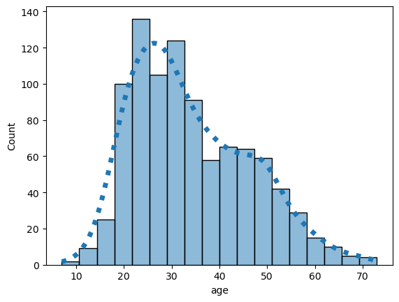
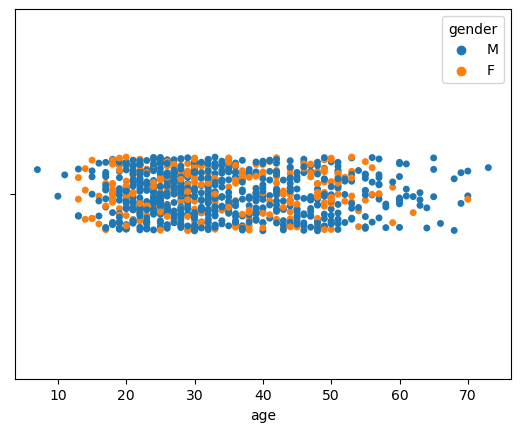
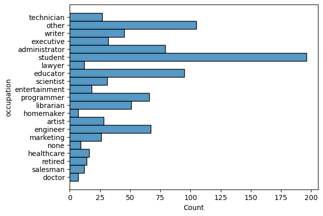
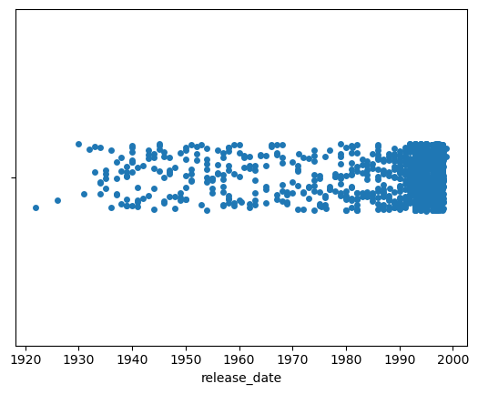
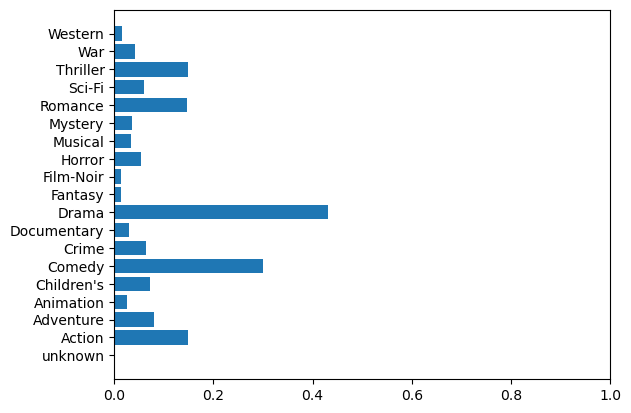
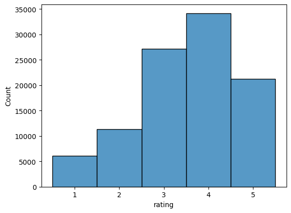

# Movie Recommender System - Assignment 2 Report

## Introduction

__Author__: Konstantin Fedorov

__Email__: k.fedorov@innopolis.university

__Group__: BS21-DS02

Recommender systems play a crucial role in enhancing user experience across various domains, offering personalized suggestions based on user preferences and behavior. In this assignment, the goal is to develop a movie recommender system using the MovieLens 100K dataset.

## Exploratory Data Analysis

The MovieLens 100K dataset consists of 100,000 ratings from 943 users on 1682 movies, providing a rich source of information for training and evaluating the recommender system. Ratings range from 1 to 5, and each user has rated at least 20 movies. Additionally, the dataset includes demographic details such as age, gender, occupation, and zip code. Every movie has its title, release data and genre.

### User

Almost every user row contains:
- Age
- Gender
- Occupation
- Zip code

#### Age and Gender

Mode of age is about 22 - 30

Gender distributes:
- Males - 670
- Females - 273

#### Occupation

Here you can see distribution of occupation

#### Zip code

Zip code should provide some geographical info about user with 795 unique values. However, it was decided to drop this value due to big number of unique values

### Movies

- Title (nothing special)
- Release date
- Video_release_date (almost all entries are NaN)
- Genre

#### Release date

Here is plot of distribution

#### Genre

We can see that Drama is most popular

### Ratings

We can see that rating distribution is similar to normal.

## Model Implementation

Final model used for solution was [LightFM](https://github.com/lyst/lightfm). Which combines collaborative and content based approaches.

Collaborative Filtering:

- LightFM uses collaborative filtering to analyze user-item interactions. It models user preferences based on their historical behavior and identifies patterns in the interactions between users and items.
- Unlike traditional collaborative filtering methods, LightFM employs a latent factor model that represents both users and items in a shared latent space. This allows the algorithm to capture complex relationships between users and items.

Content-Based Filtering:

- In addition to collaborative information, LightFM incorporates item features (content information) into its recommendation process. These features describe the characteristics of items and help the algorithm understand the content context.
- The model considers both user preferences and item features to generate recommendations, making it more versatile and capable of handling scenarios where collaborative data alone might not be sufficient.

## Model Advantages and Disadvantages

Advantages

- Hybrid Approach: LightFM's hybrid nature combines collaborative and content-based filtering

- Flexibility: whether dealing with sparse collaborative data or the cold-start problem, LightFM can provide meaningful recommendations.

- Addressing Cold-Start Issues: The incorporation of content-based features helps mitigate the cold-start problem by providing recommendations for new items or users based on their features, even when there is limited collaborative data.

Disadvantages

- Complexity and Parameter Tuning: The hybrid nature of LightFM introduces additional complexity, and tuning the model parameters effectively can be challenging. It may require careful consideration and experimentation to achieve optimal performance.

- Data Requirements: In cases where one type of data is severely lacking, the model's performance may be compromised.

- Not Designed for Sequential Data: LightFM is primarily designed for static recommendation tasks and may not be the best choice for scenarios where the temporal dynamics of user interactions or sequential patterns play a crucial role.

## Training Process

### Preprocessing

Firstly, drop `movie_release_date`, `title`, `zip code` because it's hard to vectorize. Then, normalise every other parameter between 0 and 1.

Then I converted users and items to sparse matrix. In addition, interactions between user and item were converted to adjacency matrix, where every element is rating or 0 if not present.

## Evaluation

We will use Cross Validation on 5 parts given by dataset. For evaluation MAP@10 and MAR@10 were used.

## Results

Average MAP@10 on 5 cross validation: 0.062175
Average MAR@10: 0.032051